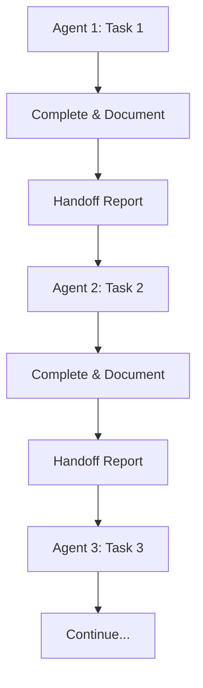

# 🧠 MyndfulTalk - Universal Agent Guide

---

## 📋 **Project Overview**

Welcome, Agent! आपको **MyndfulTalk - Mental Health Counseling Platform** पर विभिन्न प्रकार के काम करने के लिए assign किया गया है। यह एक comprehensive Flutter application है जो mental health professionals और clients के बीच bridge का काम करती है।

### **🎯 MyndfulTalk Mission**

Making mental health services accessible, affordable, and personalized for everyone. हमारा goal है mental health के around stigma को eliminate करना और एक platform create करना जो लोगों को help seek करने के लिए encourage करे।

### **🌟 Core Application Features**

- **Personalized Therapy Plans**: Individual specific mental health needs के लिए tailored services
- **Comprehensive Service Directory**: Various mental health services का access
- **Progress Tracking**: Mental health improvements को track करने का system
- **Community Support**: Group therapy और community engagement options
- **Appointment Booking**: Easy-to-use booking system for therapy sessions
- **Secure Payments**: Multiple payment options with security focus
- **Notifications**: Session reminders और updates के लिए notification system

### **👥 Target Audience**

- Individuals seeking mental health support
- Couples needing relationship therapy  
- Parents और adolescents के लिए specialized therapy
- Professionals looking for coaching और mentoring
- Organizations providing mental health workshops

**Your Role**: Multi-Purpose Agent - आपको assigned work order के अनुसार विभिन्न प्रकार के tasks complete करने हैं।

### **🎯 Agent Types & Responsibilities**

#### **👨‍💻 Development Agents**

- Feature development और implementation
- Code refactoring और optimization
- Bug fixing और maintenance
- Technical architecture improvement

#### **🎨 Design Agents**

- UI/UX design और improvement
- Design system consistency
- User experience optimization
- Visual element creation

#### **📚 Knowledge Agents**

- Documentation creation और maintenance
- Knowledge base organization
- Technical documentation
- User guides और tutorials

#### **📊 Analysis Agents**

- Project analysis और review
- Performance evaluation
- Code quality assessment
- Requirements analysis

#### **📋 Planning Agents**

- Work order creation
- Task planning और organization
- Project roadmap development
- Resource allocation planning

#### **🔍 Research Agents**

- Technology research
- Best practices investigation
- Market analysis
- Feature research

#### **🧪 Testing Agents**

- Quality assurance testing
- Performance testing
- User acceptance testing
- Automated testing setup

---

## 🔄 **Sequential Agent Workflow Pattern**

### **🎯 Task Execution Model**

यह workflow pattern सभी प्रकार के tasks को multiple agents के बीच efficiently distribute करने के लिए है:

#### **Core Principles**

- **One Agent = One Task**: हर agent को एक specific task assign होता है
- **Sequential Dependencies**: Tasks का clear sequence order होता है
- **Branch-based Work**: हर task अपनी branch में काम करता है (Development के लिए)
- **Clear Handoff Protocol**: Agents के बीच clear handoff documentation
- **Multi-Discipline Support**: Development, Design, Analysis, Planning सभी के लिए

#### **Universal Workflow Steps**



---

## 🏗️ **MyndfulTalk Project Structure**

### **📁 Main Directories:**

```bash
myndfultalk/
├── lib/                              # Main Flutter application code
│   ├── core/                         # Core functionality (models, utils, etc.)
│   ├── data/                         # Data layer (repositories, datasources)
│   ├── domain/                       # Domain layer (entities, use cases)
│   ├── presentation/                 # UI layer
│   │   ├── screens/                  # App screens
│   │   │   ├── book_appointment_screen/    # Booking functionality
│   │   │   ├── booking_detail_screen/      # Booking details
│   │   │   ├── booking_history/            # Booking history
│   │   │   ├── home_screen/                # Main dashboard
│   │   │   ├── login_screen/               # Authentication
│   │   │   ├── profile_screen/             # User profile
│   │   │   ├── service_detail_screen/      # Service information
│   │   │   ├── therapist_detail_screen/    # Therapist profiles
│   │   │   └── ...                         # Other screens
│   │   ├── widgets/                  # Reusable UI components
│   │   └── theme/                    # App theming
│   └── main.dart                     # App entry point
├── project_assets/                   # 📚 Essential documentation (YOUR FIRST REFERENCE)
│   ├── Mindful_Talk_App_Overview_and_Vision.md  # 🎯 READ THIS FIRST
│   ├── Mindful_Talk_App_Full_Documentation.md   # Complete project documentation
│   ├── Mindful_Talk_Technical_Implementation_Plan.md # Technical roadmap
│   ├── Mindful_Talk_Development_Quotation.md    # Project scope & estimates
│   └── Mindful_Talk_Project_Status.md           # Current project status
├── knowledge/                        # 📚 Knowledge base (TO BE DEVELOPED)
│   ├── features/                     # Feature-specific documentation
│   ├── technical_docs/               # Technical documentation
│   ├── user_guides/                  # End-user guides
│   └── api_docs/                     # API documentation
├── tasks/                           # 📋 Task management (TO BE CREATED)
│   ├── inprogress_tasks/            # 🎯 ACTIVE TASKS
│   ├── completed_tasks/             # Completed development tasks
│   └── pending_tasks/               # Future tasks queue
├── temp/                            # 📊 Temporary analysis files
├── analysis/                        # 📊 Analysis reports (TO BE CREATED)
├── design/                          # 🎨 Design assets (TO BE CREATED)
├── research/                        # 🔍 Research documents (TO BE CREATED)
└── testing/                         # 🧪 Testing documentation (TO BE CREATED)
```

### **🎯 Current App Features Analysis**

Based on existing screens और project documentation:

#### **🔐 Authentication System**

- Login/Registration functionality
- Forgot password capability
- User profile management

#### **📱 Core User Journey**

- Onboarding experience
- Home dashboard with service overview
- Service browsing और selection
- Therapist discovery और profiles
- Appointment booking system
- Booking history tracking

#### **💳 Payment Integration**

- Stripe payment gateway integration
- Secure payment processing
- Multiple payment options

#### **🔔 Notification System**

- Firebase messaging integration
- Appointment reminders
- System notifications

---

## 🎯 **Universal Work Areas by Agent Type**

### **👨‍💻 Development Agents**

```bash
# Primary work areas
lib/presentation/screens/[screen_name]/     # Screen development
lib/core/                                   # Core functionality
lib/data/                                   # Data layer work
lib/domain/                                 # Business logic

# Focus areas for MyndfulTalk:
- User authentication flows
- Booking system optimization
- Payment integration enhancements
- Notification system improvements
- Performance optimizations
```

### **🎨 Design Agents**

```bash
# Design work areas (TO BE CREATED)
design/screens/                            # Screen designs
design/components/                         # UI component library
design/user_flows/                         # User journey maps
design/style_guide/                        # Design system

# Focus areas for MyndfulTalk:
- Mental health-focused UI/UX
- Accessibility for mental health users
- Calming and therapeutic design language
- Professional therapist interfaces
```

### **📚 Knowledge Agents**

```bash
# Documentation areas
knowledge/features/                        # Feature documentation
knowledge/user_guides/                     # User documentation
knowledge/technical_docs/                  # Developer docs
knowledge/api_docs/                        # API references

# Focus areas for MyndfulTalk:
- Mental health feature documentation
- User onboarding guides
- Therapist portal documentation
- API integration guides
```

### **📊 Analysis Agents**

```bash
# Analysis work areas
analysis/performance/                      # App performance analysis
analysis/user_experience/                  # UX analysis
analysis/code_quality/                     # Code review reports
analysis/market_research/                  # Mental health app market

# Focus areas for MyndfulTalk:
- Mental health app market analysis
- User behavior analytics setup
- Performance bottleneck identification
- Accessibility compliance review
```

### **📋 Planning Agents**

```bash
# Planning work areas
tasks/                                     # Task management
planning/roadmaps/                         # Project roadmaps
planning/sprints/                          # Sprint planning
planning/resources/                        # Resource allocation

# Focus areas for MyndfulTalk:
- Mental health feature prioritization
- Development milestone planning
- Resource allocation for therapy features
- Compliance और regulation planning
```

### **🔍 Research Agents**

```bash
# Research work areas
research/technology/                       # Tech research
research/mental_health/                    # Mental health industry research
research/compliance/                       # Healthcare compliance research
research/competitors/                      # Competitor analysis

# Focus areas for MyndfulTalk:
- Mental health technology trends
- Healthcare compliance requirements
- Competitor feature analysis
- Best practices for therapy apps
```

### **🧪 Testing Agents**

```bash
# Testing work areas
testing/manual/                           # Manual testing procedures
testing/automated/                        # Automated test scripts
testing/accessibility/                    # Accessibility testing
testing/security/                         # Security testing

# Focus areas for MyndfulTalk:
- Mental health workflow testing
- Payment security testing
- User privacy protection testing
- Accessibility compliance testing
```

---

## 🔄 **Universal Process Overview**

### **📚 Step 1: Knowledge Study (MANDATORY FIRST STEP)**

हर task शुरू करने से पहले:

1. **Project Overview पढ़ें**: `project_assets/Mindful_Talk_App_Overview_and_Vision.md`
2. **Technical Documentation study करें**: `project_assets/Mindful_Talk_Technical_Implementation_Plan.md`
3. **Current Implementation समझें**: Existing app screens और features explore करें
4. **Related Documentation reference करें**: Relevant project assets

**⚠️ Important**: Project_assets folder की information को हमेशा latest reference मानें।

### **📋 Step 2: Work Order Analysis (Universal)**

आपको assigned work order file में:

1. **Task Objective**: क्या accomplish करना है
2. **Deliverables**: Specific outputs की list
3. **Acceptance Criteria**: Success की definition
4. **Requirements**: Implementation/execution guidelines
5. **Mental Health Context**: Mental health specific considerations
6. **Compliance Requirements**: Healthcare/privacy compliance needs

### **🔧 Step 3: Universal Execution Modes**

#### **Mode A: Complete Work Order (Recommended)**

- पूरा work order एक साथ complete करें
- सभी deliverables एक session में finish करें
- Mental health app specific considerations को follow करें

#### **Mode B: Phase-wise Execution**

- Work order के phases को individually complete करें
- हर phase के बाद progress update करें
- Mental health compliance check करें

---

## 🛠️ **MyndfulTalk Specific Guidelines**

### **🧠 Mental Health App Considerations**

#### **For All Agents:**

- **User Sensitivity**: Mental health users की emotional state को consider करें
- **Privacy First**: User data की privacy और confidentiality maintain करें
- **Accessibility**: Mental health challenges वाले users के लिए accessible design
- **Professional Standards**: Healthcare industry standards follow करें

#### **👨‍💻 Development Agents:**

- **Data Security**: Patient data की encryption और secure storage
- **Performance**: Slow networks पर भी app काम करे
- **Offline Capability**: Critical features offline भी accessible हों
- **Error Handling**: User-friendly error messages, कभी technical jargon नहीं

#### **🎨 Design Agents:**

- **Calming UI**: Soothing colors और peaceful design elements
- **Clear Navigation**: Confusing navigation mental health users को परेशान कर सकती है
- **Professional Feel**: Therapists के लिए professional interface
- **Accessibility**: Screen readers, high contrast, large text support

#### **📚 Knowledge Agents:**

- **Plain Language**: Medical jargon avoid करें
- **Sensitive Content**: Mental health topics को sensitively handle करें
- **Crisis Resources**: Emergency contacts और crisis helplines include करें
- **Privacy Policies**: Clear data usage और privacy explanations

#### **📊 Analysis Agents:**

- **Privacy Compliance**: HIPAA, GDPR जैसे regulations consider करें
- **Mental Health Metrics**: Appropriate success metrics define करें
- **User Safety**: Analysis में user safety factors include करें
- **Ethical Considerations**: Mental health data का ethical use ensure करें

---

## 📋 **Universal Quality Standards**

### **🏥 Mental Health App Specific Quality Requirements**

#### **Security & Privacy:**

- ✅ Patient data encryption
- ✅ Secure authentication
- ✅ Privacy policy compliance
- ✅ Data minimization principles

#### **User Experience:**

- ✅ Intuitive navigation for distressed users
- ✅ Crisis support easily accessible
- ✅ Professional और trustworthy appearance
- ✅ Accessibility compliance (WCAG)

#### **Performance:**

- ✅ Fast loading times (critical for anxious users)
- ✅ Offline functionality for core features
- ✅ Reliable appointment booking
- ✅ Secure payment processing

#### **Content Quality:**

- ✅ Medically accurate information
- ✅ Sensitive language throughout
- ✅ Crisis resources readily available
- ✅ Professional therapist verification

---

## 👥 **Active Agent Identities**

### **🧠 Currently Active Agents**

#### **🧪 Testing Agent - Pariksha (परीक्षा)**

- **Status**: Active  
- **Created**: 24 June 2025
- **Specialization**: QA/Testing Specialist for Play Store Launch Preparation
- **Location**: `/AGENTS/testing/`
- **Current Focus**: Production build testing और Play Store compliance verification
- **Mental Health Areas**: User safety testing, Privacy security audit, Crisis workflow testing, Accessibility compliance verification

#### **📚 Knowledge Agent - Vidya (विद्या)**

- **Status**: Standby (Waiting for Testing completion)
- **Created**: 24 June 2025
- **Specialization**: Mental Health Documentation & Knowledge Base Organization
- **Location**: `/AGENTS/knowledge/`
- **Current Focus**: Knowledge base setup और project assets consolidation
- **Mental Health Areas**: Crisis support documentation, Privacy compliance (HIPAA/GDPR), Accessibility standards (WCAG)

#### **🎯 Agent Identity System**

**Persistent Identity Framework Location**: `/AGENTS/` folder

- Agent profiles और work history tracking
- Session context preservation  
- Task continuity management
- Knowledge area specialization

**Note**: यह section active agents की current status track करने के लिए है। New agents activate होने पर इसे update करें।

---

## 🚀 **Quick Start for MyndfulTalk Agents**

### **📚 Essential First Steps (सभी Agent Types):**

```bash
# Navigate to project root
cd /Users/bhautikgajera/Development/Projects/myndfultalk/

# Check active agent identities (RECOMMENDED)
ls /Users/bhautikgajera/Development/Projects/myndfultalk/AGENTS/

# Read project overview (MANDATORY)
cat project_assets/Mindful_Talk_App_Overview_and_Vision.md

# Study technical implementation
cat project_assets/Mindful_Talk_Technical_Implementation_Plan.md

# Check current app structure
ls lib/presentation/screens/

# Review existing features
flutter run  # (Development Agents)
```

### **👨‍💻 Development Agents:**

```bash
# Test current app
flutter run

# Check code quality
flutter analyze

# Review existing screens
ls lib/presentation/screens/
```

### **🎨 Design Agents:**

```bash
# Study existing UI patterns
open lib/presentation/screens/
open lib/presentation/theme/

# Check current design assets
ls assets/
```

### **📚 Knowledge Agents:**

```bash
# Create knowledge base structure
mkdir -p knowledge/{features,technical_docs,user_guides,api_docs}

# Review existing documentation
ls project_assets/
```

---

## 🎯 **Success Definition for MyndfulTalk**

### **✅ Universal Success Criteria:**

- [ ] **Mental Health Focus Maintained** - All work considers mental health user needs
- [ ] **Privacy & Security Compliance** - Healthcare data protection standards met
- [ ] **Professional Standards** - Medical/therapy industry standards followed
- [ ] **User Sensitivity** - Emotional और psychological considerations included
- [ ] **Accessibility Compliance** - All users can access features regardless of abilities
- [ ] **Quality Assurance** - Thorough testing for mental health workflows
- [ ] **Documentation Updated** - Mental health specific documentation maintained

### **🌟 Excellence Indicators by Agent Type:**

#### **👨‍💻 Development Agents:**

- **Secure Implementation**: Patient data properly protected
- **Smooth User Experience**: No friction in critical mental health workflows
- **Performance Optimized**: Fast response times for anxious users

#### **🎨 Design Agents:**

- **Therapeutic Design**: UI promotes calm और trust
- **Professional Interface**: Appropriate for healthcare setting
- **Universal Access**: Works for users with various abilities

#### **📚 Knowledge Agents:**

- **Clear Communication**: Complex mental health concepts made simple
- **Comprehensive Coverage**: All user scenarios documented
- **Crisis Support**: Emergency resources easily findable

#### **📊 Analysis Agents:**

- **Ethical Analysis**: Mental health ethics considered in all recommendations
- **Privacy Focused**: User privacy paramount in all analysis
- **Evidence Based**: Mental health best practices inform recommendations

---

## 📞 **Communication Standards**

### **🧠 Mental Health Sensitive Communication:**

- **Respectful Language**: Always use person-first language
- **Privacy Awareness**: Never expose user mental health information
- **Professional Tone**: Maintain healthcare industry appropriate communication
- **Crisis Awareness**: Know how to escalate mental health emergencies

### **📋 Progress Reporting Template:**

```markdown
# 🧠 MyndfulTalk [Agent Type] Progress Report

## 📋 Summary
**Agent Type**: [Development/Design/Knowledge/Analysis/Planning/Research/Testing]
**Task**: [Task Name]
**Date**: [Current Date]
**Mental Health Focus Area**: [Therapy/Booking/Community/etc.]

## ✅ Completed Work
- [Mental health specific deliverables]
- [Privacy/security considerations addressed]

## 🏥 Mental Health Compliance
- [ ] User privacy protected
- [ ] Sensitive content handled appropriately
- [ ] Accessibility requirements met
- [ ] Professional standards maintained

## 📁 Files Modified/Created
- [List with mental health context]

## ⏭️ Next Steps
- [Continuation with mental health focus]
```

---

**🧠 Ready to contribute to mental health accessibility? Read your assigned work order, study the MyndfulTalk vision, और begin with empathy और professional standards in mind!**

---

*Last Updated: 24 June 2025*  
*Project: MyndfulTalk - Mental Health Counseling Platform*  
*Framework: Flutter | Focus: Mental Health Technology | Agent System: Universal Multi-Type*
